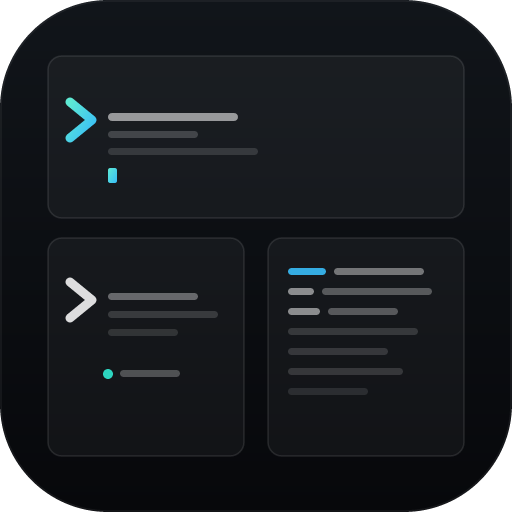

# Soryq

<p align="center">
  <br>
  <strong>A lightweight, terminal-first developer workspace for keyboard-centric professionals.</strong>
</p>

<p align="center">
  <a href="LICENSE"></a>
  
  
  
  
</p>

<p align="center"><em>This is a private repository. Soryq is distributed as prebuilt installers from the website.</em></p>

Soryq is a cross-platform desktop application that combines a real PTY terminal grid, a CodeMirror code editor, a hot-reloading web preview proxy, and git integration — all unified inside a single keyboard-driven window. Built with Tauri 2 (Rust) and Svelte 5, it stays lean: no Electron, no Node.js runtime, no background cloud services, sub-second startup.

---

## ⚡ Key Features

- **Multi-pane Terminal Grid** — Full PTY shell sessions using xterm.js, layout configuration (1/2/3/4 panes), automatic shell detection per platform, and drag-to-resize support.
- **CodeMirror 6 Editor** — Syntax highlighting for 15+ languages, built-in Vim mode, minimap, formatting, format-on-save, and word wrap.
- **Live Preview Proxy** — Built-in HTTP/WebSocket proxy that routes your local dev server through a managed port, injecting dev tools and the DOM inspector automatically.
- **DOM Inspector** — Click any element in the live preview panel to inspect its tag, computed styles, selectors, and attributes, then send it (with a screenshot) straight to the AI prompt bar.
- **Git Integration** — Review staged/unstaged changes, inspect diffs, view commit history, run commit/push actions, and discard files in milliseconds.
- **Floating Command Palette** — A unified keyboard bar that triggers file, view, terminal, formatter, and settings actions instantly.
- **Workspace Snapshots** — Capture your active layouts, editor states, and open tabs, and restore them with a single click.

---

## 📦 Installation

Download the latest build for your platform from the **[official website](https://soryq.app)**.

### Windows
Run the `.exe` setup installer.

### macOS
Open the Apple Silicon `.dmg` disk image and drag Soryq into Applications.

### Linux
Download the `.AppImage`, make it executable, and run it:
```bash
chmod +x Soryq_x86_64.AppImage
./Soryq_x86_64.AppImage
```

Soryq ships **signed auto-updates**, so it keeps itself current after install.

---

## 🚀 Quick Start

1. **Open Soryq.** Set up your theme and shortcuts inside the onboarding tour.
2. **Create a Workspace** (`Ctrl+N`) or open an existing code directory (`Ctrl+O`).
3. **Launch your Dev Server** inside the terminal (e.g., `npm run dev`).
4. **Activate the Preview Proxy** (`Ctrl+Alt+P`) to launch the live preview split pane with the DOM Inspector.
5. **Inspect elements** inside the preview and edit code in CodeMirror side-by-side.
6. **Commit & Push** changes directly from the Git integration in the sidebar.

---

## 📊 Feature Comparison

| Feature | Soryq | VS Code | Warp |
|---|---|---|---|
| **Startup Speed** | **Sub-second (Native)** | 3–5 seconds | Fast |
| **Workspace Shell** | **Tauri 2 (Rust)** | Electron (Node) | Native (Rust) |
| **Multi-pane PTY** | **Yes** | Integrated Tab | Primary focus |
| **Code Editor** | **CodeMirror 6** | Monaco Editor | None |
| **Port Preview Proxy** | **Yes + DOM Inspector** | Requires extension | None |
| **Resource Memory** | **~40–80 MB** | ~400–800+ MB | ~150–350 MB |

---

## ⌨️ Shortcut Cheat Sheet

Below are Soryq's default keyboard shortcuts. You can customize them in the settings panel (`Ctrl+,`).

| Command | Shortcut | Category |
|---|---|---|
| **Command Palette** | `Ctrl+Shift+P` | View |
| **Open Settings** | `Ctrl+,` | View |
| **New Workspace** | `Ctrl+N` | Workspace |
| **Open Folder** | `Ctrl+O` | Workspace |
| **Toggle Sidebar** | `Ctrl+B` | View |
| **Focus Terminal** | `Ctrl+` ` ` | View |
| **Focus Editor** | `Ctrl+E` | View |
| **Toggle Preview Split** | `Ctrl+\` | Editor |
| **Format Document** | `Alt+Shift+F` | Editor |
| **Start Preview Proxy** | `Ctrl+Alt+P` | Preview |
| **Toggle Scratchpad** | `Ctrl+Shift+N` | View |

---

## 🛠️ Build from Source

For detailed instructions on setting up MSVC compiler tools, Apple signing certificates, or Linux webkit libraries, read **[docs/BUILDING.md](docs/BUILDING.md)**.

```bash
git clone https://github.com/Samuel00098/soryq.git
cd soryq
npm install
npm run tauri dev
```

---

## 📄 License

Soryq is **proprietary** software. Copyright © 2026 Samuel Solesi. All rights reserved. See the [LICENSE](LICENSE) file for the full terms.

The source code is proprietary and confidential. Copying, distribution, modification, or use of this software, in whole or in part, is prohibited without the express written permission of the copyright owner.
