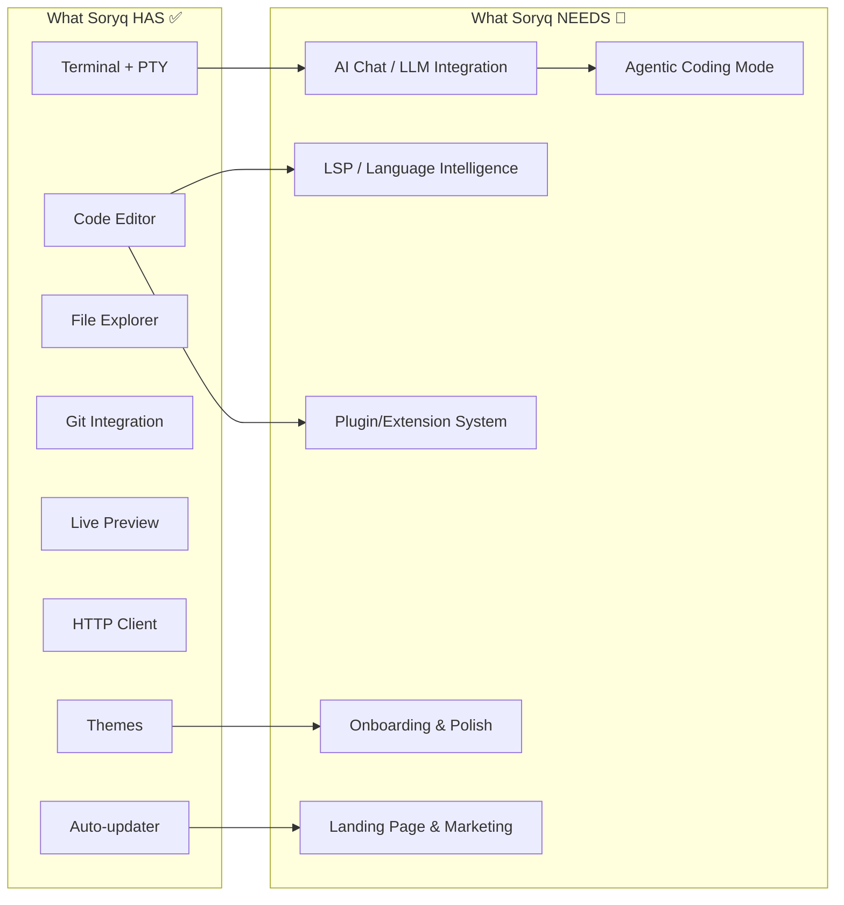

# Elevating Soryq to a Premium Developer Tool

## Where You Are Today

Soryq is already a **genuinely impressive** v0.1.0 product. Here's what you've built:

| Area | What You Have |
|------|--------------|
| **Core IDE** | CodeMirror 6 editor, multi-pane PTY terminal, file explorer, split panels |
| **DevOps** | Git integration with branch management, diff reviewer, commit history graph |
| **Preview** | Live HTTP/WS proxy with DOM inspector, markdown preview |
| **Tooling** | HTTP client, command palette, keyboard shortcuts, workspace snapshots |
| **Infra** | Tauri 2 (Rust + Svelte 5), auto-updater with signed releases, security hardening |
| **UX** | Themes, toast notifications, UI zoom, per-project layout isolation |

This is a **solid foundation**. Most indie dev tools never get this far. But there's a canyon between "a good tool" and "a tool people choose over VS Code/Cursor/Warp." Let's map out what it takes to cross it.

---

## The Competitive Landscape

Before deciding what to build, understand what you're competing against and where the gaps are:

| App | Core Identity | What Makes It "Great" |
|-----|---------------|----------------------|
| **VS Code** | Universal editor | Extension ecosystem (60k+ extensions), huge community, free |
| **Cursor** | AI-native IDE | Deep AI integration (tab completion, chat, codebase-aware edits), built on VS Code |
| **Codex (OpenAI)** | Cloud AI agent | Autonomous coding agent in sandboxed environments, multi-file edits |
| **Claude Code** | Terminal AI agent | Agentic coding in the terminal, reads/writes files, runs commands |
| **Warp** | Modern terminal | Block-based terminal output, AI command search, beautiful UI |
| **Zed** | Performance IDE | GPU-rendered, collaborative editing, blazing fast |
| **Windsurf** | AI IDE | Flow-based AI assistance, similar to Cursor but different UX |

> [!IMPORTANT]
> **You don't need to beat all of them.** You need to pick a clear identity and be the **best** at that one thing. The apps above that succeeded didn't try to be everything — they picked a wedge and owned it.

---

## The 6 Pillars You Need to Address

### 1. 🤖 AI Integration (The Biggest Gap)

This is the **#1 thing** that separates a 2024-era dev tool from a 2026-era one. Every app you mentioned (Codex, Claude Code, Cursor) is fundamentally an AI product.

**What you have now:** A floating prompt bar (visual only — no AI backend).

**What you need:**

#### Tier 1: Inline AI Chat (High Priority)
- A sidebar or floating panel that connects to LLM APIs (OpenAI, Anthropic, Google, local Ollama)
- **Codebase-aware context**: The AI can see your open files, project structure, terminal output
- **@ mentions**: `@file`, `@terminal`, `@error` to attach context to prompts
- Users bring their own API keys (BYOK model — no server costs for you)

#### Tier 2: AI-Powered Editor Features (Medium Priority)
- **Tab completion / ghost text**: Copilot-style inline suggestions using an LLM
- **Inline edits**: Select code → "refactor this" → see a diff → accept/reject
- **Error explanation**: Right-click a terminal error → "Explain this" → AI responds with fix

#### Tier 3: Agentic Mode (Aspirational)
- Let the AI **write files, run commands, and iterate** — like Codex/Claude Code
- Sandboxed execution in a dedicated terminal pane
- Approval-based: user reviews each action before it runs
- This is what would make Soryq truly competitive in 2026

**Effort:** Tier 1 = ~2-4 weeks. Tier 2 = ~4-6 weeks. Tier 3 = ~2-3 months.

> [!TIP]
> **Quick win:** Start with Tier 1 BYOK chat panel. It's the fastest way to make Soryq feel "modern" and is table stakes in 2026.

---

### 2. 🧩 Plugin / Extension System

**Why it matters:** VS Code's moat is its extension ecosystem. You'll never match 60k extensions, but you *can* offer a clean plugin API that lets power users extend Soryq.

**What you need:**

- **Plugin API**: A JavaScript/TypeScript API that plugins call to register commands, sidebar panels, editor actions, and terminal hooks
- **Plugin manifest**: `soryq-plugin.json` describing name, version, activation events
- **Plugin manager UI**: Install, enable/disable, configure plugins from settings
- **Example plugins**: A few first-party plugins to seed the ecosystem:
  - Language server protocol (LSP) client for autocomplete/diagnostics
  - Docker container management sidebar
  - Database browser (SQLite/PostgreSQL)
  - REST API collection (Postman-lite — you already have the HTTP client!)

**Effort:** Plugin API design + runtime = ~4-6 weeks. LSP client = ~3-4 weeks.

> [!WARNING]
> Without at least an LSP client, Soryq's editor will always feel like a "fancy notepad" compared to VS Code/Cursor. LSP support is what turns an editor into a real IDE (autocomplete, go-to-definition, hover docs, diagnostics).

---

### 3. 👥 Collaboration & Cloud Features

**What the top-tier apps offer:**

| Feature | Who Has It |
|---------|-----------|
| Real-time collaborative editing | Zed, VS Code Live Share |
| Cloud workspace sync | Cursor, Codex |
| Shared terminal sessions | Warp |
| Team settings/themes | VS Code |

**What to consider for Soryq:**

- **Workspace sync via Git** (low effort) — export/import workspace configs as `.soryq/` config files committed to the repo
- **Shared terminal sessions** (medium effort) — peer-to-peer terminal sharing via WebRTC
- **Cloud workspaces** (high effort) — remote dev containers that Soryq connects to

> [!NOTE]
> For a v0.x product, skip real-time collaboration. Focus on workspace portability (`.soryq/` config files) so teams can share settings through their existing Git workflow.

---

### 4. ⚡ Performance & Reliability Hardening

Your Tauri + Rust stack gives you a performance advantage over Electron apps. **Lean into this.**

**What to prioritize:**

- **Startup time benchmarking**: Measure and optimize cold start. Target < 1 second to first render. Display this in marketing ("opens in 0.6s")
- **Memory profiling**: Track RAM usage under load (10+ files open, 4 terminal panes, preview running). Compare to VS Code and publicize the difference
- **Large file handling**: Test with 100k+ line files in the editor. Add virtualized rendering if not already present
- **Crash recovery**: Auto-save editor state every 30s. On crash, restore everything on next launch
- **Telemetry (opt-in)**: Crash reports + anonymous usage analytics to find real-world bugs. Use Sentry or a self-hosted alternative

**Effort:** ~2-3 weeks for the full hardening pass.

---

### 5. 🎨 UX & Design Polish

**What separates "good" from "premium":**

#### Visual Design
- **Onboarding experience**: A guided first-run walkthrough (3-4 steps) that introduces key features
- **Animations & transitions**: Panel open/close, tab switch, sidebar expand — all should have subtle spring animations (not just `display: none` toggles)
- **Loading states**: Skeleton loaders for file tree, git status, preview. Never show a blank panel
- **Empty states**: Meaningful illustrations and CTAs when there's no content (empty editor, no git repo, etc.)
- **Icon system**: A cohesive icon set (consider Phosphor Icons or Lucide) instead of mixed Unicode/emoji

#### Information Architecture
- **Settings redesign**: Categorized settings with search (like VS Code's settings UI)
- **Status bar enrichment**: Show more context — active Git branch (✓ you have), language mode, line/column, encoding, indentation, AI connection status
- **Breadcrumbs**: File path breadcrumbs above the editor with click-to-navigate
- **Minimap enhancement**: Show search result highlights, git diff markers, and error locations in the minimap

#### Accessibility
- Screen reader support (ARIA labels on all interactive elements)
- High contrast theme
- Keyboard navigation for every panel

**Effort:** ~3-4 weeks for a comprehensive polish pass.

---

### 6. 📦 Distribution & Business Strategy

**Getting users:**

| Channel | Action |
|---------|--------|
| **Website** | A stunning landing page with animated demos, comparison tables, download buttons. This is your #1 marketing asset |
| **GitHub** | Professional README with screenshots/GIFs, proper releases, issue templates, discussions |
| **Social** | Dev Twitter/X, Reddit (r/programming, r/rust, r/webdev), Hacker News launch |
| **Package managers** | `winget`, `brew`, `snap`, `flatpak`, AUR |
| **YouTube** | 2-3 minute walkthrough video showing the "wow" moments |

**Monetization (if desired):**

| Model | Approach |
|-------|----------|
| **Open core** | Free core + paid "Pro" features (AI integration, cloud sync, team features) |
| **BYOK** | Free tool, users bring their own API keys — you never touch the LLM costs |
| **Sponsorware** | Features developed for GitHub sponsors first, open-sourced after threshold |

> [!TIP]
> The most successful indie dev tools (Warp, Zed) raised VC money. If you're bootstrapping, the **open core + BYOK AI** model is the most sustainable path. Your core tool stays free and open source; you charge for team/cloud features.

---

## Recommended Design Direction

Based on what Soryq already is, here's the identity I'd recommend:

> **Soryq = The AI-native, lightweight alternative to VS Code for developers who want speed and simplicity.**

Key positioning messages:
1. **"Faster than Electron"** — Tauri advantage, sub-second startup
2. **"AI built in, not bolted on"** — Unlike VS Code + Copilot extension
3. **"Everything in one window"** — Terminal + Editor + Preview + Git + AI
4. **"Your keys, your models"** — BYOK, no vendor lock-in, privacy-first

### Visual Design Direction

Aim for a design language that feels like a blend of:
- **Warp's** terminal polish (block-based output, gorgeous typography)
- **Linear's** UI craft (subtle gradients, micro-animations, attention to spacing)
- **Arc Browser's** personality (opinionated defaults, delightful interactions)

Key design tokens to consider:
- **Font**: Use a premium monospace font like JetBrains Mono or Fira Code (with ligatures) as default
- **Spacing**: 4px base grid, generous padding (don't cram UI elements)
- **Colors**: Muted, harmonious palette with one accent color. Avoid pure black backgrounds (#000) — use rich dark grays (#0d1117, #161b22)
- **Borders**: 1px with low-opacity borders (rgba(255,255,255,0.06)) for panel separation
- **Radius**: Consistent 6-8px border-radius on cards/panels, 4px on buttons/inputs

---

## Prioritized Roadmap

Here's the order I'd build things, based on impact vs. effort:

### Phase 1: Make It Feel Premium (2-3 weeks)
- [ ] Onboarding walkthrough (first-run experience)
- [ ] Animation pass (panel transitions, tab animations, loading states)
- [ ] Empty states with illustrations
- [ ] Screenshot-worthy landing page
- [ ] Professional GitHub README with GIFs

### Phase 2: AI Chat Integration (3-4 weeks)
- [ ] BYOK settings panel (API key management for OpenAI/Anthropic/Google/Ollama)
- [ ] AI chat sidebar panel
- [ ] Context injection: `@file`, `@terminal`, `@selection`
- [ ] Stream responses with markdown rendering
- [ ] Terminal error → "Explain this" action

### Phase 3: Editor Intelligence (4-6 weeks)
- [ ] LSP client integration (autocomplete, diagnostics, go-to-definition)
- [ ] AI inline completions (ghost text)
- [ ] AI inline edits (select → transform → diff preview → accept)

### Phase 4: Plugin System (4-6 weeks)
- [ ] Plugin API design and runtime
- [ ] Plugin manager UI
- [ ] First-party plugins: enhanced Git, Docker, database browser

### Phase 5: Agent Mode (6-8 weeks)
- [ ] Agentic AI: file writes, command execution, multi-step reasoning
- [ ] Sandboxed execution in dedicated terminal pane
- [ ] Approval flow UI (review each action before execution)
- [ ] Tool-use framework (read file, write file, run command, search codebase)

### Phase 6: Scale & Community (Ongoing)
- [ ] Package manager distribution (winget, brew, etc.)
- [ ] Community plugin registry
- [ ] Crash reporting and telemetry
- [ ] Performance benchmarks and marketing

---

## Summary: The Gap at a Glance

> [!IMPORTANT]
> **The single most impactful thing you can do right now** is add AI chat with BYOK API keys. In 2026, a developer tool without AI feels like a 2018 product. Everything else — plugins, collaboration, performance — is important but secondary to this.

---

## Questions for You

1. **What's your target user?** Solo indie devs? Teams? Students? This shapes everything from features to pricing.
2. **Are you building this as a business or a passion project?** This determines whether to prioritize monetization or community growth.
3. **Do you want to support extensions/plugins?** This is a huge engineering investment but creates a moat.
4. **What's your timeline?** Are you thinking "ship AI in 2 weeks" or "build the perfect product over 6 months"?
5. **Local-first AI or cloud AI?** Ollama (local) gives you a privacy story. Cloud APIs give you power. Both?
